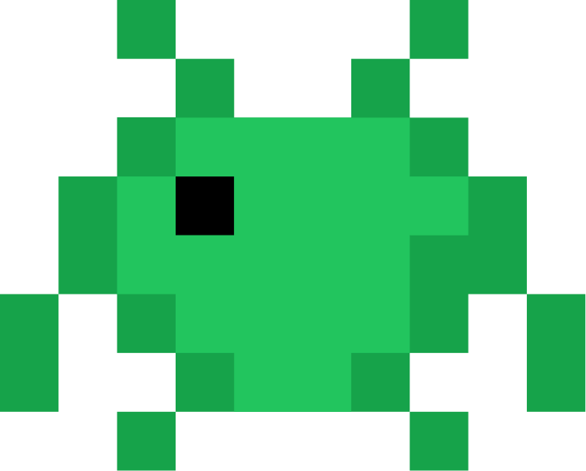

# Sprites

The Sprites plugin gives Claude Code hosted MCP access to persistent, isolated development environments, plus skills and confirmation hooks for safe remote workflows.

After installation, run `/sprites:status` to list visible Sprites and complete OAuth if needed. Run `/sprites:smoke` for an end-to-end list, create, and exec check with cleanup only after approval. Run `/sprites-inspector` to browse Sprites, their services, checkpoints, and logs in a read-only pane, and to point Claude at one.

The local Claude Code workspace and the remote Sprite filesystem are separate. Use the plugin-provided MCP tools for Sprite commands, services, checkpoints, and policy. Do not install the Sprites CLI or register a second MCP server for normal plugin use.

See the [repository documentation](https://github.com/superfly/sprites-claude-plugin) for installation, authentication, safety, and troubleshooting details.
